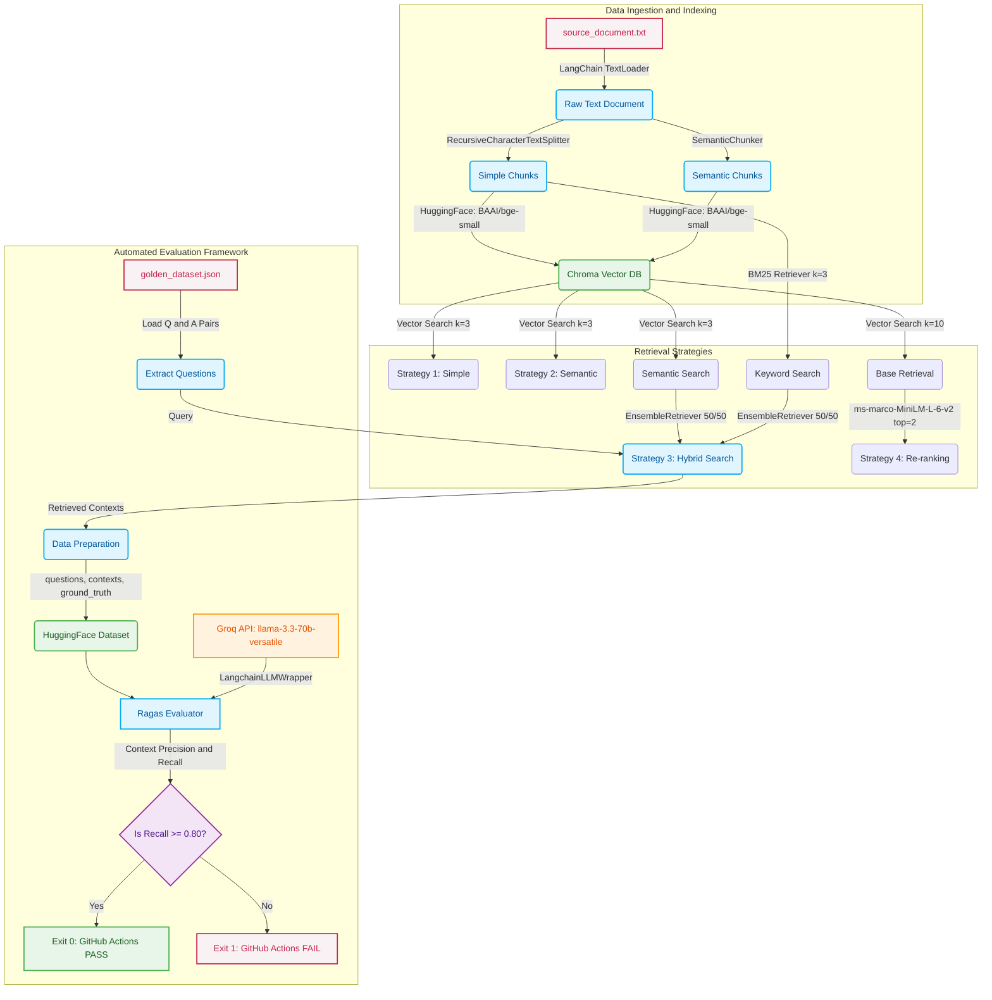

# RAG Evaluation Pipeline

This repository contains a production-grade Retrieval-Augmented Generation (RAG) pipeline designed to systematically compare various document retrieval strategies. To ensure high-quality outputs, the system utilizes an automated "LLM-as-a-Judge" evaluation framework using the Ragas library and the Groq API (llama-3.3-70b-versatile).

## System Architecture

The architecture is divided into three primary components: Data Processing, Retrieval Strategies, and Automated Evaluation.



## Retrieval Strategies
1. **Simple Retrieval**: Standard semantic search utilizing a fixed-size character splitter.
2. **Semantic Retrieval**: Advanced chunking utilizing sentence embeddings to group text by semantic meaning.
3. **Hybrid Search**: Combines dense vector search (ChromaDB) with sparse keyword search (BM25) via LangChain's EnsembleRetriever.
4. **Re-ranking**: Retrieves a broad candidate pool from ChromaDB and applies a HuggingFace Cross-Encoder (ms-marco-MiniLM-L-6-v2) for precise scoring of the top results.

## Evaluation and Test Results

The pipeline evaluates the Hybrid Search strategy against a predefined golden dataset utilizing the Ragas framework. The Groq API (llama-3.3-70b-versatile) serves as the impartial judge.

### Execution Output

```text
--- Starting RAG Evaluation ---
Setting up Hybrid Search Strategy...
Loading document from data/source_document.txt...
Initializing Embeddings: BAAI/bge-small-en-v1.5...
Loading Golden Dataset...
Retrieving contexts for each question...
Initializing Groq LLM as a Judge (llama-3.3-70b-versatile)...
Running Evaluation using Ragas (Context Precision & Context Recall)...

--- Final Evaluation Results ---
{'context_precision': 0.9500, 'context_recall': 1.0000}

Context Precision: 0.95
Context Recall: 1.00
SUCCESS: Context Recall meets the threshold.
```

### Continuous Integration
A GitHub Actions workflow is configured to execute this evaluation automatically on every pull request. If the Context Recall score falls below the required threshold of 0.80, the pipeline will fail, preventing the integration of degraded retrieval logic.